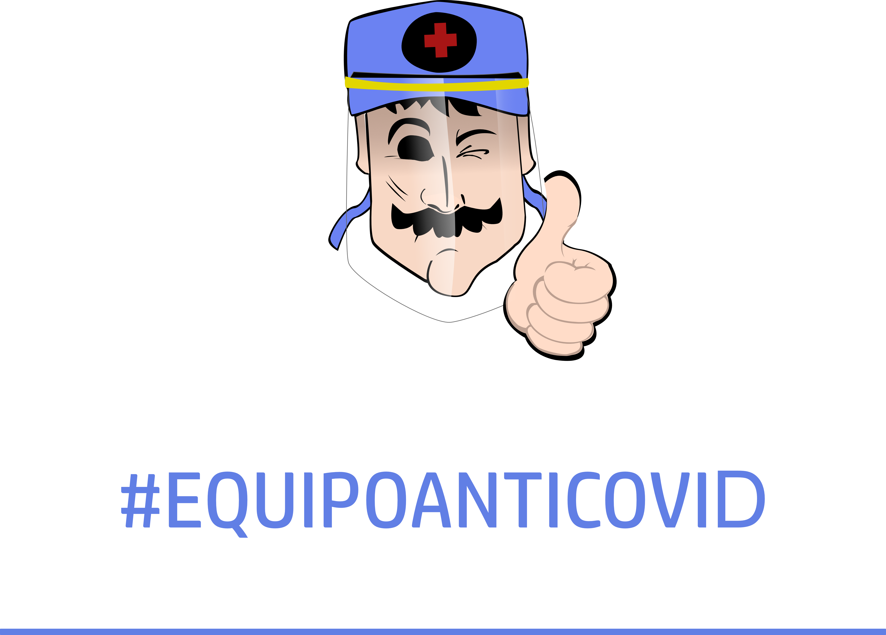
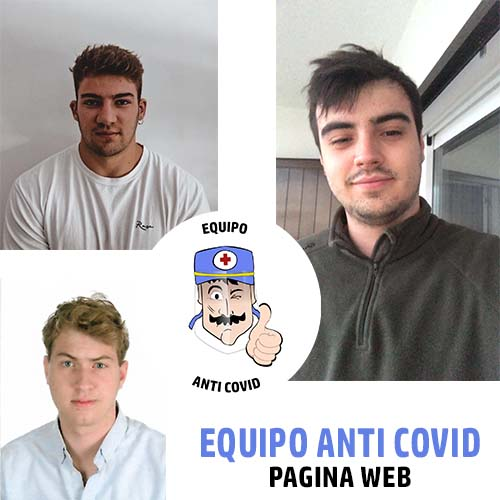

[![Contributors][contributors-shield]][contributors-url]
[![Forks][forks-shield]][forks-url]
[![Tags][tags-shield]][tags-url]
[![MIT License][license-shield]][license-url]
[![LinkedIn][linkedin-shield]][linkedin-url]
[![Instagram][instagram-shield]][instagram-url]

<!-- PROJECT LOGO -->
 

  

  <h1 align="center">Anti Covid Team</h1>

  

    Non-profit project originated in the Pandemic of 2020, made by young university students, to produce 3D printed screens for the protection of doctors and nurses at Madrid hospitals in the beginning of the pandemic.
     
    <a href="https://github.com/matbmoser/AntiCovidTeam"><strong>Explore the docs »</strong></a>
     
     
    <a href="https://github.com/matbmoser/AntiCovidTeam">View Demo</a>
    ·
    <a href="https://github.com/matbmoser/AntiCovidTeam/issues">Report Bug</a>
    ·
    <a href="https://github.com/matbmoser/AntiCovidTeam/issues">Request Feature</a>
  

## History and Work Developed

Access our [Instagram](https://www.instagram.com/equipoanticovid/) to know more about our actions during the 2020 Pandemic:

[https://www.instagram.com/equipoanticovid/](https://www.instagram.com/equipoanticovid/)

### Built With

* [PHP 8](https://www.php.net/releases/8.0)
* [JavaScript](https://www.javascript.com/)
* [Visual Studio Code](https://code.visualstudio.com/)

(<a href="#top">back to top</a>)

### Web Desing and Programming Team

This webpage was made within 2 weeks, in order to offer users the posibility of buying materials for the 3D Masks and Protection Shields printting.

Team Members:

* Jorge Aguirre del Val | [`@jorgeAguirre99`](https://github.com/jorgeAguirre99). [LinkedIn](https://www.linkedin.com/in/jorge-aguirre-del-val-a555ba182/)
* Mathias Brunkow Moser | [`@matbmoser`](https://github.com/matbmoser) or `@matbmoser1` (Old profile) [LinkedIn](https://www.linkedin.com/in/mathias-brunkow-moser/)
* David Molero Peña | [LinkedIn](https://www.linkedin.com/in/davidmolerope%C3%B1a/)

<!-- LICENSE -->
## License

Distributed under the MIT License. See `LICENSE.md` for more information.

(<a href="#top">back to top</a>)

<!-- MARKDOWN LINKS & IMAGES -->
<!-- https://www.markdownguide.org/basic-syntax/#reference-style-links -->
[contributors-shield]: https://img.shields.io/github/contributors/matbmoser/AntiCovidTeam.svg?style=for-the-badge
[contributors-url]: https://github.com/matbmoser/AntiCovidTeam/graphs/contributors
[forks-shield]: https://img.shields.io/github/forks/matbmoser/AntiCovidTeam.svg?style=for-the-badge
[forks-url]: https://github.com/github_username/AntiCovidTeam/network/members
[tags-shield]: https://img.shields.io/github/v/tag/matbmoser/AntiCovidTeam.svg?sort=semver&style=for-the-badge
[tags-url]: https://github.com/matbmoser/AntiCovidTeam/tags
[issues-shield]: https://img.shields.io/github/issues/matbmoser/AntiCovidTeam.svg?style=for-the-badge
[issues-url]: https://github.com/matbmoser/AntiCovidTeam/issues
[license-shield]: https://img.shields.io/github/license/matbmoser/AntiCovidTeam.svg?style=for-the-badge
[license-url]: https://github.com/matbmoser/AntiCovidTeam/blob/master/LICENSE.md
[linkedin-shield]: https://img.shields.io/badge/-LinkedIn-black.svg?style=for-the-badge&logo=linkedin&colorB=555
[linkedin-url]: https://linkedin.com/in/mathias-brunkow-moser
[instagram-shield]: https://img.shields.io/badge/-Instagram-white.svg?style=for-the-badge&logo=Instagram
[instagram-url]: https://www.instagram.com/equipoanticovid/
[product-screenshot]: images/screenshot.png
